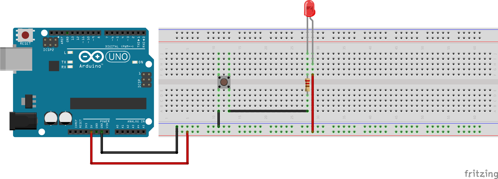
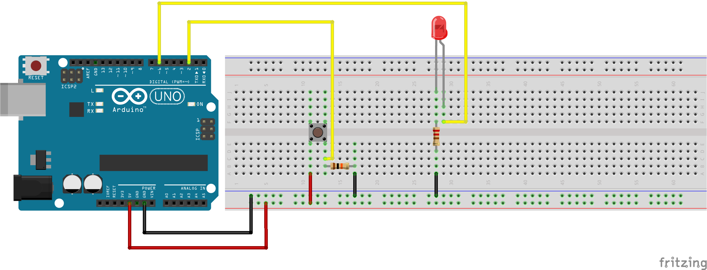

# Week 01 · Course Introduction

Let's dig into our new kit of parts! But first, download the [Arduino Independent Development Environment](https://www.arduino.cc/en/Main/Software).

- [Components](#components): Arduino Uno, Jumper Cable, Breadboard, LED, Resistor, Pushbutton, Potentiometer, Photoresistor
- [Circuits](#circuits): Various LED Controllers
- [Code](#code): pinMode(), digitalRead(), digitalWrite(), analogRead(), delay(), Serial Communication, if(){}, else{}
- [Homework](#homework) : Wearable LED Controller

-----

### Components

#### Arduino Uno Rev 3


The most famous and best-supported hobbyist microcontroller (uC) of all time, based on the ATmega16U2 processor. At 16 MHz (16,000,000 operations per second) it can talk to other devices over serial communication (USB cable), interact with digital and analog sensors through 20 general purpose input-output (GPIO) pins, toggle motors and leds, chirp and beep and make music, hibernate to save power and automatically wake up under certain circumstances, and provide and manage power for many other components. It's amazing, and tutorials for beginners and professionals alike are common all over the internet.

The Arduino, unlike the Raspberry Pi, does not offer a graphical user interface. It is designed for embedded applications, interacting with *sensors* and *actuators* through branching, simple coded structures in a unique language that shares much in common with C, C++, and Java. The simplicity and expressibility of the Arduino language makes it an ideal place to start coding. The Arduino has no memory, and no contextual awareness on its own.

Arduino is a *specification*, rather than a singular product. It comes in many shapes and sizes, manufactured and released by many different companies and organizations targeted for different applications — a few of which will be explored thoughout the course. Read more about the mission and history of the [Arduino project](https://www.arduino.cc/en/Guide/Introduction).

#### Jumper Cable


More properly a *Dupont Cable*, but often just called *jumpers*, we use these to make electrical connections. The Arduino operates at very low power settings, with little risk of harming a developer. Nevertheless, better to make connections with wires than fingers! We will often use male->male jumper cables, though female->male and female->female connections are available as well.

Wiring can get confusing, do your best to encode your connection logic in your wire colors and use appropriate wire lengths. 

- Red for 5V Power
- Orange for 3V3 Power
- Black, White, Gray, or Brown for Ground
- Yellow or Purple for Generic Signals
- Green and Blue for I2C Communication

There are many alternatives to wires for making connections — conductive fibers and textiles, ink, solder, and 

#### Breadboard


The breadboard looks like a boring piece of plastic with some holes in it. But, inside, there are some bits of metal that allows us to prototype connections much more easily. In landscape orientation...

- Each of the *rows* of holes near the red and blue stripes — on both top and bottom of the breadboard — are connected all the way across. We call these the *rails* of the breadboard, and they are often used to manage power.

- Each of the *columns* inside the *rails* are connected vertically in sets of usually 5. This connection is broken across the middle of the bread board. Individual components often occupy several columns to get power and data in and out. 


#### LED (Light Emitting Diode)


LEDs convert electricity into light! They come in many different packages, colors, sizes, beam angles, and brightness levels. Each LED has an anode (long leg, current in) and a cathode (short leg, power out). Though LEDs are often rightfully praised for their low power requirements, high brightness LEDs and LED matrices/strips often require their own dedicated power supplies. Learn more about how LEDs work [here](https://learn.sparkfun.com/tutorials/light-emitting-diodes-leds).

#### Pull Up Resistor


The 10K Ohm resistor is used in combination with  buttons and other sensors to ensure that current flows and that the state of the pin is always known. Otherwise, power would not flow directly to ground through the sensor, and the individual pin value would be *floating* between high and low. Pull Up Resistors (resistors with high resistance values, which resist *less*) and Pull Down Resistors (resistors with low resistance values, which resist *more*) are often used in this way, and will be discussed in future weeks. You can [read more](https://learn.sparkfun.com/tutorials/pull-up-resistors) about resistors, but they will be confusing for a while.

Get to know the resistor color code! The amount of electricity resisted by these little bits of ceramic is encoded in their colored stripes.	


#### Pushbutton


Buttons are simple components in complex packagings. They are effectively broken wires, that are fully reconnected when the button is pressed down. This allows a user to control the flow of electrons. Buttons often have multiple exposed pins, allowing several connections to be made on a single press. Our simple pushbuttons have 4 legs total — permanently connected in sets of 2. On depression, all 4 legs get connected together.

Buttons come in [many different form factors and sizes](https://www.sparkfun.com/search/results?term=button) for different applications, with slightly different behaviors.

----- 

### Circuits

#### Direct LED Control

Control an LED by making a connection with a button.



#### Programmatic LED Control

Control an LED by reading a button state with Arduino.



-----

### Code

```c
//button on pin 2
//led on pin 6

//code in setup runs once
void setup() {
  //Are the GPIO pins speaking or listening?
  pinMode(2, INPUT);
  pinMode(6, OUTPUT);

  //turn on serial (usb) communication
  Serial.begin(9600);

}

//code in loop runs over and over
void loop() {
  //store if the button is pressed or unpressed in a reusable variable
  int buttonState = digitalRead(2);
  Serial.print("Button Reading: ");
  Serial.println(buttonState);

  //make a decision based on buttonState
  if (buttonState == 1) {
    //turn on LED
    digitalWrite(6, HIGH);
    //prevent flicker
    delay(10);
  }

  else {
    //turn off LED
    digitalWrite(6, LOW);
    //prevent flicker
    delay(10);
  }
}
```

-----

### Homework

With *3 Buttons* and *3 colored LEDS*, create a body-mounted LED controller *without modifying your breadboard*. Please use only raw materials (no Lego parts or pre-fabricated/sourced components), get into the Shop!

How could such an object be useful? Other than having a 1:1 relationship between buttons and LEDs, what could some other designed behaviors be? Could an additional button manage whether or not LEDs flash? Could multiple LEDs be active at once, and if so, how could button presses manage all the possible permutations? 