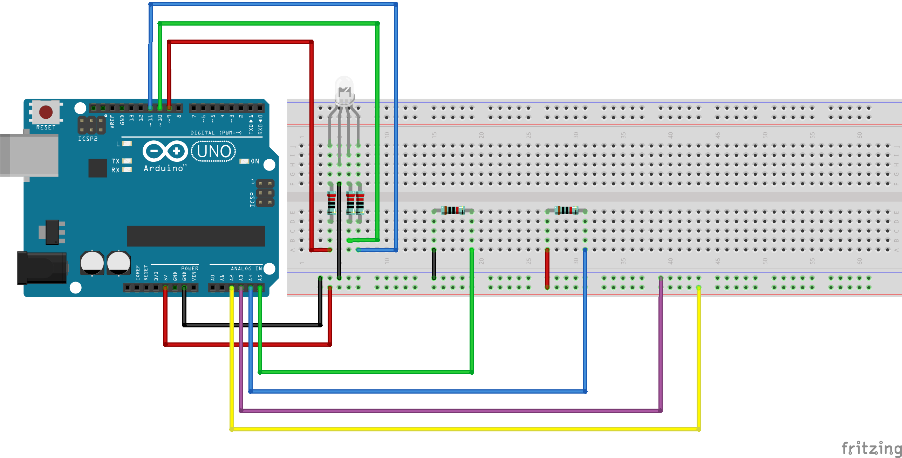
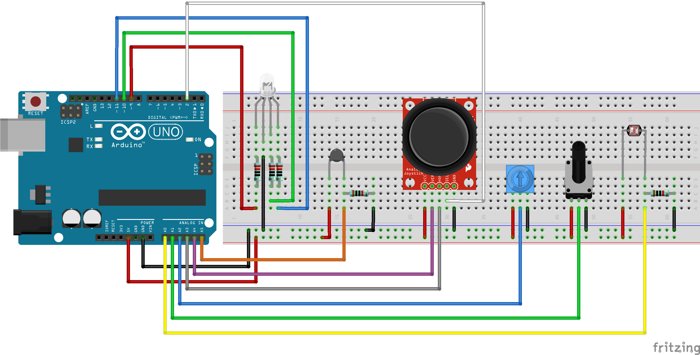

# Week 02 · Analog vs. Digital

Last week, we learned how to use a button and LED with *digital control*. We could see if a button was pressed or not, and turn an LED on and off. Digital controls are great for components where there are only two state – components that have *binary* inputs or outputs. 

But, far more intereseting and useful in design context are *analog* components which offer a range of input or output values. Most simple and inexpensive sensors are analog sensors, which are effectively resistors with variable resistance. Even cooler than analog components proper are pulse-width-modulated (PWM) components which use a *high frequency digital signal* to emulate an analog signal.

Be aware that the use of the terms *digital* and *analog* in this context refer specifically to a kind of data, and do not imply the [total nonsense](https://www.soundonsound.com/techniques/digital-myth) that infects the high-end audio world, which continues to make an argument that analog audio sounds better — or is a more accurate reproduction — than digital audio. Neither is better or worse, or has the capability for more or less accuracy — the two are simply different ways of encoding data. 

First, make sure you [download and install Fritzing](http://fritzing.org/download/), a great open source program for drawing pretty circuit diagrams.

- [Hydraulic Analogy for Electricity](https://learn.sparkfun.com/tutorials/voltage-current-resistance-and-ohms-law/current)
- [Components](#components): RGB LED, Trimpot, Potentiometer, Photoresistor, Thermistor
- [Circuits](#circuits): Analog Sensor Array
- [Code](#code): analogRead(), analogWrite(), map(), constrain()
- [Homework](#homework) : Wearable Nighlight

-----

### Components

#### RGB LED (Common Cathode)

3 LEDs in one -- use this component to mix colors and produce your own colored light! RGB LEDs have three independently controllable subdiodes for red, green, and blue light. Common Cathode RGB LEDs, like the ones that come in our kits, combine *ground* for all three of the internal LEDs. Common Anode RGB LEDs, also available and more common in higher quality LEDs, combine *voltage in*.

Review [additive color mixing principles](https://en.wikipedia.org/wiki/Additive_color) to better understand why red + green does not make brown! 

#### Trimpots and Potentiometers

Potentiometers, and their tiny family members trimpots, are resistors - though their resistance is not set and instead changes depending on the position of a knob. As the knob is rotated clockwise, a conductive wiper inside moves along a resistive strip, forcing the electrons to travel through more or less resistive material. This attenuates the electrical signal, weakening it proportionally.

#### Photoresistor (or Light-Dependent Resistor)

This small *analog* sensor relys on the flexion that occurs when a lead-based metal alloy (wash your hands after touching it!) is exposed to light and minutely adjusts its electrical resistance. The more light that strikes the [photoresistor](https://en.wikipedia.org/wiki/Photoresistor) and its characteristic wave-shaped *bandgap*, the more voltage can flow through the component. In the darkness, the component has a high resistance and prevents the flow of electrons from jumping the bandgap. Photoresistors are used in any object that need to reference the general intensity of light or shadow in a space, and are frequently used in for day-night behavior switching.

In order to use a photoresistor, we use a [voltage divider circuit](https://learn.sparkfun.com/tutorials/voltage-dividers). In a voltage divider, the ratio between a *fixed resistor* (usually 10k) and a *variable resistor* is reflected in a measured output voltage.

#### Thermistor

Similar to the photoresistor and wired the same way, a thermistor is a variable resistor that changes its resistance depending on an external phenomenon — namely temperature. As ambient heat increases (or decreases, depending on the [type of thermistor](https://en.wikipedia.org/wiki/Thermistor#Steinhart–Hart_equation)), the resistance increases. That increase is not instantaneous, though it is predictable and consistent. Importantly, thermistors generate waste heat and heat themselves up over time! This makes them unreliable for longterm and precision application. Further, hobbyist thermistors are sensitive to a narrow range of temperatures — but more [advanced temperature sensors](https://www.sparkfun.com/search/results?term=temperature+sensor) are available that can measure all kinds of temperatures and don't introduce their own heat. 

[A complicated equation](https://en.wikipedia.org/wiki/Thermistor#Steinhart–Hart_equation) can actually convert the analog voltage readings from thermistors to real temperatures, though that operation is computationally expensive and the results are always fairly noisy. Read more about thermistors and how to get real temperature values out of them [here](https://learn.adafruit.com/thermistor/using-a-thermistor).

----- 

### Circuits

Remember to try to wire with an encoding schema in mind...

- Red for 5V Power
- Orange for 3V3 Power
- Black, White, Gray, or Brown for Ground
- Yellow or Purple for Generic Signals
- Green and Blue for I2C Communication

But, since we are using so many sensors, we can vary our sensor wire colors for clarity. Always choose wire colors for understandability, even if it means violating the above guidelines! 

#### Measuring Analog Voltage

Check your expectations and review pullup and pulldown resistors

#### Analog Sensor Array

Check the outputs of various analog sensors

-----

### Code

Double check that "Tools" -> "Board" is set to "Arduino/Genuino Uno" and that "Tools" -> "Port" is set to whichever "COM" USB port has a connected "Arduino Uno".

Come back after class! 

-----

### Homework

With your RGB LED, create a wearable nightlight! Ensure that the intensity of the LED varies according to ambient light conditions so it only turns on when it's dark. Could we use a thermistor to turn off the nighlight after a user's body temperature falls below a certain threshold (should they, for example, fall asleep)? Could we use a pushbutton to toggle between photoresistor intensity control and potentiometer light intensity control? Or could the user control the color of the nightlight? Could we use a pushbutton to turn the nighlight on and off?

Create your circuit and behavior, make it wearable, and then use Fritzing to produce a diagram of your work.