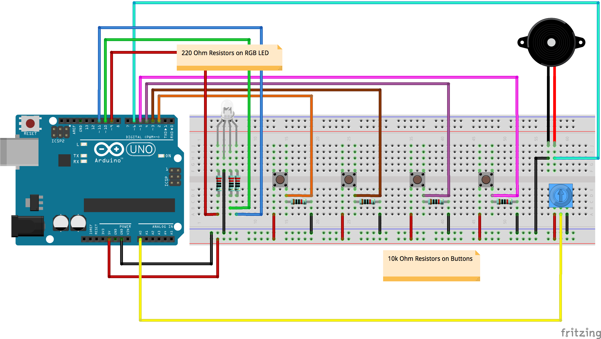

# Week 03 · Looping

We've so far written code that runs from top to bottom. *Check a sensor*, *do some math*, *send out a signal*. We've looked at branching with `if(){}` and `else{}` as a way to allow code to make a decision, but our code has never before iterated or looped through a set of repeatable commands, or remained in a certain state until something changed. Let's make that happen today and massively increase our programming power.

We'll look at music as a space to explore controlled looping. Please check out [this wikipedia page](https://en.wikipedia.org/wiki/Piano_key_frequencies) as a reference for the frequency parameter of musical notes.

- [Hydraulic Analogy for Electricity](https://learn.sparkfun.com/tutorials/voltage-current-resistance-and-ohms-law/current)
- [Components](#components): Passive and Active Piezo Buzzer
- [Circuits](#circuits): Keyboard and Drum Machine
- [Code](#code): tone(), for(){}, while(){}
- [Homework](#homework) : Wearable Instrument

-----

### Components

#### Passive Piezo Buzzer

*Piezo* is a prefix and standalone term that comes up frequently in electronics. It always refers to how materials that assume a crystalline structure like minerals and ceramics can store electric charges, and when they do, oscillate and vibrate at very predictable rates. This works in both directions — a small crystal will vibrate at a certain frequency when a current of a certain voltage is passed through it, and if one vibrates that same small crystal at that same frequency, it will produce identical voltage. For this reason, piezo crystal oscillators (often called 'quartz' oscillators) are used in just about any computational system to keep accurate time.

A piezo buzzer uses this physical phenomenon to use electricity to vibrate a small crystal, which in turn displaces a certain amount of air. This displacement creates a vacuum, and a [sound wave](https://en.wikipedia.org/wiki/Sound#Sound_wave_properties_and_characteristics) is formed. Beep! 

Piezo buzzers create monophonic waves with little possible expressibility. Notably, with additional coding work, other [shapes of sound waves](https://en.wikipedia.org/wiki/Square_wave) than regular square waves can be made that approximate more natural sounds. They will always sound like SNES buzzes, beeps, and bloops. [Clever coding and fancy wiring](http://www.opencircuits.com/Microcontroller_polyphony) can produce [simple polyphony](https://en.wikipedia.org/wiki/Polyphony), but piezo buzzers will never sound like a violin or a saxophone. 

#### Active Piezo Buzzer

Active buzzer, with black epoxy on bottom, at left. Passive buzzer, with green PCB, at right. 

Active buzzers are fancier than passive buzzers, but operate on the same principle. An electric current is passed through a crystal, causing a small but very fast vibration — which in turn creates an air pressure wave. An active buzzer has an oscillator built into it, so all that is required is applied voltage to make sound (no PWM pin necessary). A constant `HIGH` signal will make sound, no `LOW` pulsing is required. There's very little reason to choose a more expensive and complicated Active Buzzer over a Passive Buzzer, unless you are totally out of PWM pins.

----- 

### Circuits

Remember to try to wire with an encoding schema in mind...

- Red for 5V Power
- Orange for 3V3 Power
- Black, White, Gray, or Brown for Ground
- Yellow or Purple for Generic Signals
- Green and Blue for I2C Communication

But, since we are using so many buttons this week, we can vary our sensor wire colors for clarity. Always choose wire colors for understandability, even if it means violating the above guidelines! 

#### Keyboard and Drum Machine

Let's make some noise.

-----

### Code

Double check that "Tools" -> "Board" is set to "Arduino/Genuino Uno" and that "Tools" -> "Port" is set to whichever "COM" USB port has a connected "Arduino Uno".

Come back after class! 

-----

### Homework

Create a wearable electronic instrument. Allow the user to control notes, rhythm, and/or volume.

For inspiration, take a look at this [Kickstarter project](https://www.kickstarter.com/projects/elasticbrand/audiowear-the-1st-hip-hop-album-made-w-porcelain-j) by Elasticbrand, that went on to [star](https://madmuseum.org/sonic-arcade-audiowear) in a [wonderful show](https://madmuseum.org/sonic-arcade-shaping-space-with-sound) at the Museum of Art and Design in New York on contemporary musical instrument design. The [Jacquard jacket by Levis + Google](https://atap.google.com/jacquard/) is another wearable musical 'instument' that uses conductive fibers to control music playback. And, of course, the most painfully cool current company on the face of the earth, [Teenage Engineering](https://www.teenageengineering.com).

You also may want to check out [this documentary on Robert Moog](https://www.youtube.com/watch?v=XRg8R-00mjs) and the birth of electronic music, a woefully underappreciated design and technology revolution that directly paved the way to *fundamentally new sounds* for the human species, and led to the character of nearly all music produced today.

Create your circuit and behavior, make it wearable, and then use Fritzing to produce a diagram of your work.