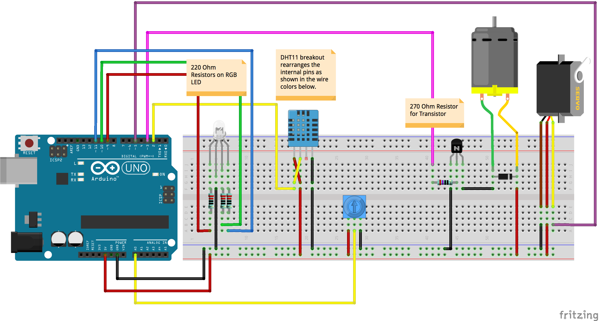

# Week 04 · Odds and Ends · DC Motors, Non-Continuous Servo, Digital Sensor and Libraries, and Soldering

Let's use our new PWM and looping abilities to work on DC motors, and leverage digital signaling to access a servo motor and a temperature/humidity sensor. 

- [Hydraulic Analogy for Electricity](https://learn.sparkfun.com/tutorials/voltage-current-resistance-and-ohms-law/current)
- [Soldering Tutorial Review](https://www.youtube.com/watch?v=Qps9woUGkvI)
- [Components](#components): DC Motor, Servo Motor, Transistor, Diode, DHT11 Sensor
- [Circuits](#circuits): Personal Fan
- [Code](#code): for(){}, Serial.available(), Serial.parseInt()
- [Homework](#homework) : Wearable Instrument

-----

### Components

#### DC Motor

A DC motor converts electricity into a magnetic field, which in turn drives rotational movement. Inside the motor housing, a set of permanent magnets exert force on the 'armature', a carefully shaped piece of wire through which electrons flow. The magnets exert a force on the electrons as they pass through the cylinder of the motor, and torque is created according to Fleming's [Left Hand Rule](https://en.wikipedia.org/wiki/Fleming%27s_left-hand_rule_for_motors). DC motors are designed to spin fast, and not to exert much torque. For this reason, they often require [gearing up or down](https://en.wikipedia.org/wiki/Gear).

Motors are simple components, but they require a couple of safety measures [explained well here](http://www.sharetechnote.com/html/Arduino_MotorBasics.html). Rather than driving motors directly with a PWM pin, it is very important to use a transistor with a PWM pin as well as a diode to protect the Arduino.

Fancy motor driving chips, like the well-known [L293D](https://www.adafruit.com/product/807), can toggle the polarity of the signal and allow a DC motor to spin in both directions. With a transistor, though, only one direction of spin is possible.

Motors require electricity to spin, but they can also be spun to *produce electricity*. When used in this way, DC motors are instead called turbines, and are deployed all over the world as [hydroelecric and anemoelectric generators](https://en.wikipedia.org/wiki/Water_turbine). This allows for fun power storage and reclamation projects [like this one](https://www.wired.com/story/battery-built-from-concrete/).

#### NPN Transistor

Transistors sit at the heart of every general purpose computer, making up the processors of computers. Transistors are fundamentally switches — but rather than relying upon a human for actuation — an electric current is used to open a connection. Whatever is connected to the *collector* leg is released to the *emitter* leg when the *base leg* receives power above a certain threshold. Read that last sentence a few times, and it will make sense!

Transistors are often used to manipulate high voltage and amperage electrical components with low voltage controllers and drivers.

#### Diode

Diodes are simple components. They are wires, but they only allow the flow of electricity in one direction. In most cases, diodes are used as *flybacks*, which [protect components from high kickback voltage](https://en.wikipedia.org/wiki/Flyback_diode). Diodes always have a stripe or mark on them near their *cathode*. Electrons can only flow through diodes from anode to cathode, so commonly in circuits, it looks like they are connected backwards — since they are there for protection! [All LEDs are diodes](https://learn.sparkfun.com/tutorials/polarity/diode-and-led-polarity), it just so happens that they convert electons flowing through them into visual photos, rather than heat.

#### (Micro)Servo Motor

Servo motors are DC motors with a reducing [gear train](https://en.wikipedia.org/wiki/Gear_train) inside as well as a control board. Depending on the length of pulses received on a signal wire, the servo motor will turn to a specific degree. This motion takes time, and so it is important to add `delay()`s to your code to provide time for the movement to complete. Servos are essential for most robotics and controlled motion applications. Microservos, like the ones included in our kits, are normally limited to a bit less than 180 degrees of motion. 'Continous Rotation' servos allow for full 360 degree motion.

#### DHT11 Temperature and Relative Humidity Sensor

A semi-water permeable substrate layer next to a thermistor inside this sensor allows for a *relatively* accurate reading of both ambient temperature and humidity. Theoretically, the DHT11 is rated to a precision of plus or minus 2 degrees celsius and 5% humidity, though due to manufacturing realities, the sensor often requires calibration. Despite its analog sensing logic, this sensor communicates over a digital pin — and like most sensors, requires installing a library.

The sensor package itself has *4 legs*, from left to right: power, signal, no connection (NC), ground. It is often mounted on a breakout board, which rearranges those connections (signal, power, ground), integrates the required pullup resistor, and removes the useless *NC* leg. 

----- 

### Circuits

Remember to try to wire with an encoding schema in mind...

- Red for 5V Power
- Orange for 3V3 Power
- Black, White, Gray, or Brown for Ground
- Yellow or Purple for Generic Signals
- Green and Blue for I2C Communication

#### Personal Fan

Spinning and thermometering! 

-----

### Code

Double check that "Tools" -> "Board" is set to "Arduino/Genuino Uno" and that "Tools" -> "Port" is set to whichever "COM" USB port has a connected "Arduino Uno".

Come back after class! 

-----

### Homework

A week off from breadboarding!

- Solder 10 wires onto 10 other wires. Make some jewelery! 
- Solder your backpack onto your LCD screen component
- Check out the sensors available on [Sparkfun.com](https://www.sparkfun.com/categories/23) and [Adafruit.com ](https://www.adafruit.com/category/35) and identify 3 that are interesting to discuss. Try to find a tutorial for each of the 3 and read through what would be required to get it working. What kind of data does it produce?

