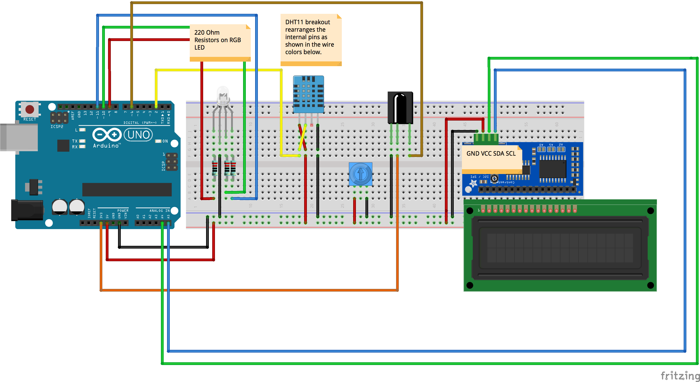

# Week 05 · Action at a Distance

Let's use get some libraries into play, and implement more advanced digital sensors and actuators. We'll focus this week on how to go about glueing sample code together.

- [Components](#components): IR Remote and Receiver, LCD Backpack, DHT11 Temperature and Humidity Sensor
- [Circuits](#circuits): Remote Control Color Light
- [Code](#code): ! (not), various libraries, function declarations, compound conditionals, type casting
- [Homework](#homework) : Wearable Instrument

-----

### Components

#### IR Remote and TSOP38238 Receiver


This combination of components allows us to signal the Arduino at a distance and actuate selectively based on a variety of different button presses.

Fundamentally, an IR remote is just an LED that blinks light *really fast* that we can't see. Most IR remotes operate at 940 nanometers, which is above the human eye's limit of around 700 nanometers. If we were far more sensitive like a [salamander more attuned to IR raditation](https://en.wikipedia.org/wiki/Axolotl), our skin might be able to sense an IR remote blast as heat! 

When different buttons are pressed on an IR remote, unique patterns are flashed by the infrared LED, sort of like [Morse Code](https://en.wikipedia.org/wiki/Morse_code) or [semaphore](https://en.wikipedia.org/wiki/Flag_semaphore). This sort of signaling has [been around since the early industrial revolution](https://en.wikipedia.org/wiki/Infrared#History_of_infrared_science), and yet the technology world is currently abandoning it for Bluetooth and NFC — which often makes for less reliable, more complex, and far power-hungrier outcomes. Nevertheless, designers continue to do [some super interesting experiments](http://niklas-isselburg.com/project-binairy_talk.php) in the space. In the consumer electronics world, universal and learning remotes like [Logitech Harmony Remotes](https://www.logitech.com/en-us/harmony-universal-remotes) can mimic the flashing patterns of other remotes and send appropriate signals to device receivers.

Due to the fast switching nature of the infrared signal's carrier signal (38,000 cycles per second) and the slow processing of the Arduino Uno's PWM pins (~500 cycles per second), the signal needs to be processed by an IR receiver: the TSOP38238. The receiver component converts the various fast switching operations, and demodulates it (decodes and slows it down) for our microcontroller.

Learn more about the complex [modulation and demodulation](https://learn.sparkfun.com/tutorials/ir-communication#ir-communication-basics) that makes every television remote work. It's magic that this stuff operates at all, and yet it's so commonplace that we only notice it when it fails. 


#### Liquid Crystal Display (LCD) and I2C Backpack


Finally, some visual feedback! 

These simple screens — still common in calculators, microwaves, and fitness trackers amongst other household digital objects — rely on the previously mentioned relationship between crystals and electricity. Each one of a field of tiny crystals uses a mated transistor to straighten out or rotate. When energized, the [crystal rotates and blocks polarized light](https://www.explainthatstuff.com/lcdtv.html) from passing through it, kind of like window blinds. Otherwise, it is an ugly, mostly transmissive green. An LED backlight of variable color is often placed behind the crystal matrix, so that contrast can be improved. LCD displays are amazingly low power-consumptive compared to most other display types.

16 pins are used to control an LCD display with a backlight. 4 manage power, 1 controls the brightness of the LED backlight, 2 handle selecting and writing to specific memory registers (used to set where to display characters), and 8 handle the choice of characters themselves and data transfer (which needs to happen in a very particular sequence).


This is crazy, it would eat up most of our Arduino's available pins on its own! 

Because of the complexity of the pinout of LCD components, we will use a simplifying code libary and hardware *backpack*, whose sole job is to reduce the number of pins required to plug in the component. This particular backback leverages the [I2C digital communication standard](https://learn.sparkfun.com/tutorials/i2c), common to hobbyist digital sensors. I2C, short for "inter-integrated circuits" and pronounced "eye-squared-sea," was invented in 1982 to aid in the digital communication between a fast 'master' device and many slower attached 'slave' devices — solving the timing problems exhibited by its competitor standard, SPI (to be discussed later). Each device in an I2C system needs to have a unique address, and up to 111 unique devices can be connected in the same circuit, usually *on the same 4 pins*. This expands our Arduino's reach considerably.

(BTW the offensive and anachronistic naming convention unfortunately chosen by the I2C creators is currently being attacked by most [progressive computer scientists](https://www.theregister.co.uk/2018/09/11/python_purges_master_and_slave_in_political_pogrom/). Let's hope it soon gets replaced.)

I2C is an easy to implement standard that uses pins labels `SDA` and `SCL` for all communication. `SDA` carries the *da*ta between master and slave, and `SCL` keeps the *cl*ock of those transfers, so that each can speak and listen at the right times. On our Arduino Uno's, I2C connections happen on the Analog Pin Header: `SDA` is pin `A4` and `SCL` is pin `A5`, as is visible in the circuit diagram below.


Good times.


#### DHT11 Temperature and Relative Humidity Sensor (Repeat from last week...)


A semi-water permeable substrate layer next to a thermistor inside this sensor allows for a *relatively* accurate reading of both ambient temperature and humidity. Theoretically, the DHT11 is rated to a precision of plus or minus 2 degrees celsius and 5% humidity, though due to manufacturing realities, the sensor often requires calibration. Despite its analog sensing logic, this sensor communicates over a digital pin — and like most sensors, requires installing a library.

The sensor package itself has *4 legs*, from left to right: power, signal, no connection (NC), ground. It is often mounted on a breakout board, which rearranges those connections (signal, power, ground), integrates the required pullup resistor, and hides the useless *NC* leg. 


----- 

### Circuits

Remember to try to wire with an encoding schema in mind...

- Red for 5V Power
- Orange for 3V3 Power
- Black, White, Gray, or Brown for Ground
- Yellow or Purple for Generic Signals
- Green and Blue for I2C Communication

#### Remote Control Color Light

[Spooky action at a distance](https://www.technologyreview.com/s/427174/einsteins-spooky-action-at-a-distance-paradox-older-than-thought/). 



-----

### Code

Double check that "Tools" -> "Board" is set to "Arduino/Genuino Uno" and that "Tools" -> "Port" is set to whichever "COM" USB port has a connected "Arduino Uno".

In your Arduino package manager, ensure you install the `IRremote by shirriff` library as well as the `DHT Sensor Library by Adafruit`. The author of the IRremote library has an [interesting blog](http://www.righto.com/2009/08/multi-protocol-infrared-remote-library.html) with lots of IR technology experiments.

Download and install the [1.3.5 New Liquid Crystal Library](https://bitbucket.org/fmalpartida/new-liquidcrystal/downloads/).

#### Basic LCD Display

```c
/*
Pins:
SCL = A5
SDA = A4
VCC = 5V
GND = GND
*/

//necessary libraries
#include <Wire.h>
#include <LCD.h>
#include <LiquidCrystal_I2C.h>

//create an LCD with the default pinout arrangement and address
LiquidCrystal_I2C lcd(0x27,2,1,0,4,5,6,7); 

void setup()
{
    //this means that the LED backlight is on pin 3 and is pulled low, so a low signal turns the lED off.
    lcd.setBacklightPin(3,POSITIVE);
    //turn on the backlight
    lcd.setBacklight(HIGH); // NOTE: You can turn the backlight off by setting it to LOW instead of HIGH
    //turn on the lcd, with a 16x2 matrix 
    lcd.begin(16, 2);
    //wipe the screen
    lcd.clear();
}

void loop()
{
    //move the cursor to top left
    lcd.setCursor(0,0);
    lcd.print("i <3 arduino!");
    //move the cursor to the bottom left
    lcd.setCursor(0,1);
    lcd.print("arduino <3 me!");
    delay(100);
}
```

#### LCD and DHT11 Combination

```c
//necessary libraries for both components
#include <Wire.h>
#include <LCD.h>
#include <LiquidCrystal_I2C.h>
#include "DHT.h"

//necessary constants for DHT
#define DHTPIN 2     
#define DHTTYPE DHT11


//create LCD object with the default pinout arrangement and address
LiquidCrystal_I2C lcd(0x27, 2, 1, 0, 4, 5, 6, 7);
//create DHT object
DHT dht(DHTPIN, DHTTYPE);


void setup()
{
  //this means that the LED backlight is on pin 3 and is pulled low, so a low signal turns the lED off.
  lcd.setBacklightPin(3, POSITIVE);
  //turn on the backlight
  lcd.setBacklight(HIGH); // NOTE: You can turn the backlight off by setting it to LOW instead of HIGH
  //access lcd, with a 16x2 matrix
  lcd.begin(16, 2);
  //wipe the screen
  lcd.clear();

  //access DHT sensor
  dht.begin();
}


void loop()
{
  //move the cursor to top left
  lcd.setCursor(0, 0);
  //get data from sensor
  float t = dht.readTemperature();
  //do string combination. it's also possible to just move cursor around and avoid this step
  lcd.print( "TMP: " + String(t) + "*C");

  //move the cursor to bottom left
  lcd.setCursor(0, 1);
  //get data from sensor
  float h = dht.readHumidity();
  //do string combination. it's also possible to just move cursor around and avoid this step
  lcd.print( "HMD: " + String(h) + "%" );

  //wait a bit to prevent flicker
  delay(500);

  //wipe the screen to prevent data persistence. not really necessart here since the strings on the screen will always be the same length 
  lcd.clear();
}
```

-----

### Homework

Combine the LCD screen and IR Receiver components

- When a button on the remote is pressed, show the name of that button — *not its hex or decimal ir code* — on the LCD screen.
- When buttons 1, 2, and 3 are pressed, turn on and off the red, green, and blue subdiodes of an RGB LED.
- Bonus Challenge: Could other buttons on the remote control blinking speed of the LED? Brightness? Color blending?