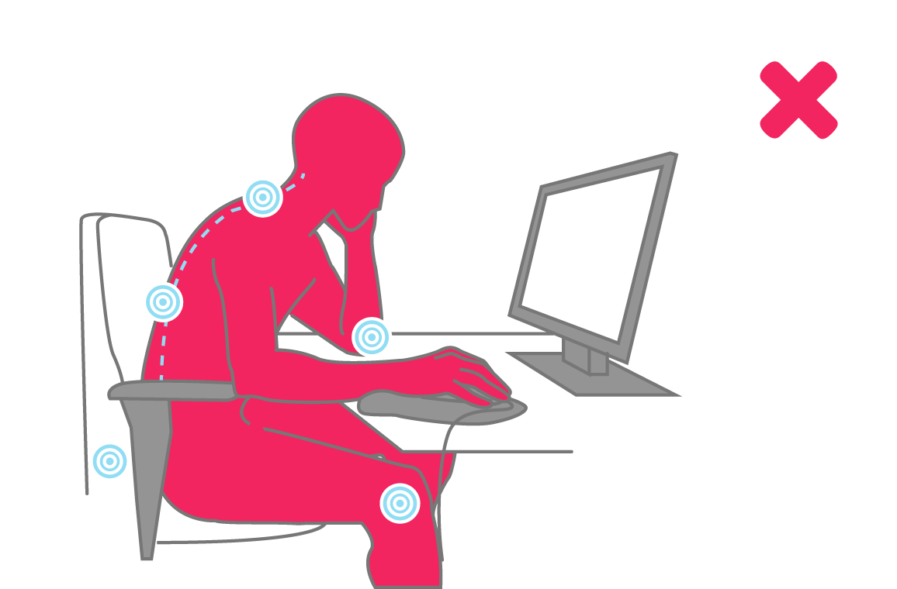

# Week 07 · Midterm Review and Looking Forwards

We've covered nearly all of the [Arduino programming languge](https://www.arduino.cc/reference/en/)\*, and worked through almost all of the parts in our [expansive kit](https://www.amazon.com/EL-KIT-003-Project-Starter-Tutorial-Arduino/dp/B01D8KOZF4?keywords=arduino+starter&qid=1534530757&sr=8-1-spons&ref=mp_s_a_1_1_sspa&psc=1) in 7 short weeks. In that time, we've looked at [analog and digital signaling](../week02/README.md), [handling operations in repeating loops](../week03/README.md), [kinetics and libraries](../week04/README.md), [i2c communication and string manipulation](../week05/README.md), as well as [collecting multiple datapoints to derive a synthetic understanding of the world](../week06/README.md). We've connected to LEDs, motors, resistors, simple and complex sensors, buttons, potentiometers in many different packages, buzzers, and LCD screens. That's a lot!

Now, let's synthesize all these bits and pieces into practice.

- [Daily Challenge](#challenge)

\* We haven't touched *interrupts* or *arrays* much, two holes that we'll patch after the midterm break.

-----

### Challenge

A challenge for the day:

Envision a set of digital tools for *designers*, a health-awareness-limited group, to use while at work to *improve their posture*. The tools can use whatever sensors and components you have access to, and anything you can find on Sparkfun or Adafruit.

Envision and sketch out three different tools for this purpose. Then, write some pseudo-code. How might these tools be the same and differ in their approach, components, and coding? What are your ethics for posture improvement — will you be confrontational or subtle in your entraining? What aspect of posture will you aim to improve? How have others attacked the problem with technology?
 
  1. A tool *embedded in the environment*. Electronics in the walls, in furniture, in the ceiling... where else could we hide these components?

  2. A *wearable tool* to be mounted on the body. How intimate does it need to be to the body? Where and how could it attach for minimal (or maximal!) invasiveness? 

  3. A combination *environmental and wearable tool*. How could the two subassemblies communicate with one another? What is gained when you have two separate access points?

If you don't have a necessary sensor, investigate it, and continute to detail out the circuit but use some placeholder component that produces comparable behavior or data (photoresistor, potentiometer, ir remote...).

Build out one of your envisioned tools as much as possible on a breadboard and write some code for it!
