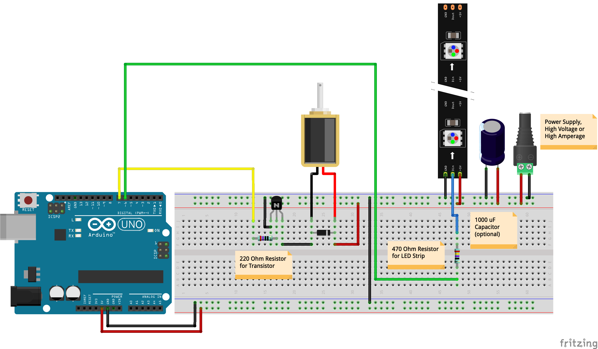

# Week 10 · Odds and Ends v2

Random stuff to spend time on today. Continue researching and sourcing components, find precedents and example code, begin to think about final form and materiality and how we can prototype it — and most importantly remember that your [project has several deliverables](../briefs.md) outside of a working circuit!

-----

### Tutorials for Fusion 360

We will soon need to prototype housings for our components by hand or digital fabrication. Feel free to use any 3D modeling package that you already know. Fusion360 is free, easy to use and learn, and taking over the traditional product design world — so it is definitely recommendable if you're just getting started in 3D!

- [Official Beginner's Tutorial](https://www.youtube.com/watch?v=VbSkwvZyU_0) 
- [Alternate Beginner's Tutorial for Whistle](https://www.youtube.com/watch?v=2NzsDcvxLyo)
- [Snap-Fit Case](https://www.youtube.com/watch?v=VVmOtM60VWw)
- [Arduino Enclosure](https://www.youtube.com/watch?v=nf4B6sZ_u4o)
- [Living Hinges and Latches](https://www.youtube.com/watch?v=bZ9yxoiFlqI)
- [Sculpting Organic/Ergonomic Forms](https://www.youtube.com/watch?v=l_YLbw1Aeos)
- [EagleCAD Circuit Design to Fusion360 (Advanced)](https://www.youtube.com/watch?v=-dki1H_z8q8)

-----

### Designing and Soldering onto PCBs

Soon we will want to remove the breadboards from our setups and make smaller, more permanent connections. Protoboard (called Perfboard as well) allows quick and easy intermediate prototyping.

- [ProtoBoard Soldering](https://www.youtube.com/watch?v=3N3ApzmyjzE)

Alternatively, and perhaps for a bit later in the process, we can design and have custom printed circuit boards made.

- [PCB Layout in Fritzing](https://www.youtube.com/watch?v=aCw6q6rndIU)
- [Fritzing Fab](http://fab.fritzing.org)

- [Autodesk Eagle](https://www.autodesk.com/products/eagle/overview)
- [Eagle CAD Tutorial Series](https://www.youtube.com/watch?v=1AXwjZoyNno)

---

### Separated Power Lines

Quick example of how we can provide power to components from a separate source of equal or different voltage and/or amperage. 

The circuit here uses [Adafruit Neopixel Strips](https://learn.adafruit.com/adafruit-neopixel-uberguide/the-magic-of-neopixels), which come in a variety of form-factors, and a [Power-Hungry Solenoid](https://www.adafruit.com/product/412).

---

### Homework

Prepare a small presentation on your project to share with the class next week. Please include the following...

- Project Objective and Scope
- Target Audience
- Components Under Consideration
- Sketches / Simple Renders
- Live Circuit
- Unanswered Questions / What You Need Help On